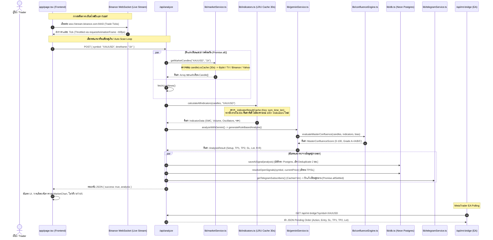
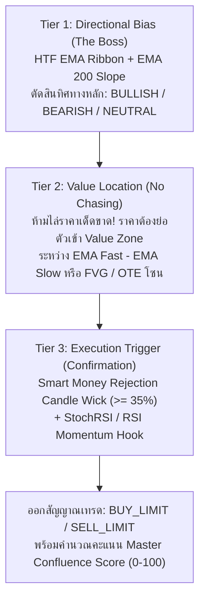

# 🤖 AGENTS.md — สถาปัตยกรรมระบบและการอธิบายโค้ดเชิงลึก (Deep-Dive Codebase Architecture Guide)

> **สำหรับ AI Coding Agents (Cursor, Claude Code, Gemini, Copilot, Antigravity) และวิศวกรซอฟต์แวร์**  
> *เอกสารนี้อธิบายโครงสร้าง สถาปัตยกรรม การไหลของข้อมูล และรายละเอียดโค้ดของทุกระบบในโปรเจกต์ Aegis Quant Terminal อย่างละเอียดระดับฟังก์ชันและอัลกอริทึม เพื่อให้เข้าใจบริบททันทีและกระโดดลงมือทำงานได้อย่างแม่นยำ 100% โดยไม่ทำให้ระบบพัง*

---

## 📑 สารบัญ (Table of Contents)

1. [⚡ ข้อมูลภาพรวม & กฎเหล็กสำคัญ (Critical Orientation & Rules)](#1-ข้อมูลภาพรวม--กฎเหล็กสำคัญ)
2. [🗺️ ผังโครงสร้างไดเรกทอรีทั้งระบบ (Complete Codebase Directory Map)](#2-ผังโครงสร้างไดเรกทอรีทั้งระบบ)
3. [🔄 ลำดับการประมวลผลข้อมูลระดับระบบ (End-to-End Data Pipeline)](#3-ลำดับการประมวลผลข้อมูลระดับระบบ)
4. [🧠 การอธิบายโค้ดเชิงลึกแยกตามระบบ (Deep-Dive Code Explanations)](#4-การอธิบายโค้ดเชิงลึกแยกตามระบบ)
   - [4.1 Data Feeds & Ingestion Layer (`lib/marketService.ts`, `lib/websocketFeed.ts`)](#41-data-feeds--ingestion-layer)
   - [4.2 Quantitative Indicators Engine (`lib/indicators.ts` - 10k บรรทัด)](#42-quantitative-indicators-engine)
   - [4.3 Decision & Confluence Brain (`lib/geminiService.ts`, `lib/confluenceEngine.ts`)](#43-decision--confluence-brain)
   - [4.4 Anti-Clash Strategy Orchestrator (`lib/strategyOrchestrator.ts`)](#44-anti-clash-strategy-orchestrator)
   - [4.5 Autonomous Auto-Pilot Scanner (`lib/autonomousEngine.ts`, `api/autonomous-scanner`)](#45-autonomous-auto-pilot-scanner)
   - [4.6 Risk Management & Micro-Sizing Engine (`lib/riskEngine.ts`, `lib/priceIntegrity.ts`)](#46-risk-management--micro-sizing-engine)
   - [4.7 Macro News & Global Session Shields (`lib/calendarEngine.ts`, `lib/sessionEngine.ts`)](#47-macro-news--global-session-shields)
   - [4.8 Neon Postgres Database & Resilient Queries (`lib/db.ts`)](#48-neon-postgres-database--resilient-queries)
   - [4.9 Telegram Broadcast & Alert Dispatcher (`lib/telegramService.ts`)](#49-telegram-broadcast--alert-dispatcher)
   - [4.10 MetaTrader (MT4 / MT5) Bridge (`api/mt-bridge`, `mql/`)](#410-metatrader-mt4--mt5-bridge)
   - [4.11 UI & Dashboard Frontend (`app/page.tsx`, `components/`)](#411-ui--dashboard-frontend)
   - [4.12 Machine Learning & Feature Engineering (`lib/featureEngineering.ts`, `lib/mlEngine.ts`)](#412-machine-learning--feature-engineering)
   - [4.13 Caching, Resilience & Utilities (`lib/cache.ts`, `lib/resilience.ts`, `lib/logger.ts`)](#413-caching-resilience--utilities)
5. [🎯 Task-to-File Matrix (ตารางลัดกระโดดไปจุดแก้โค้ด)](#5-task-to-file-matrix)
6. [🛠️ คำสั่งการทดสอบและข้อกำหนดของ AI (Commands & Coding Rules)](#6-คำสั่งการทดสอบและข้อกำหนดของ-ai)

---

## 1. ข้อมูลภาพรวม & กฎเหล็กสำคัญ

- **ชื่อระบบ:** Aegis Quant Terminal (`ai-market-indicator`)
- **เทคโนโลยีหลัก:** Next.js 14 (App Router), React 18, TypeScript 5, Tailwind CSS, `@neondatabase/serverless` (Postgres Connection Pooling), TradingView `lightweight-charts`.
- **วัตถุประสงค์:** เทอร์มินัลวิเคราะห์การเงินเชิงปริมาณ (Quantitative Trading Terminal) ตรวจจับสัญญาณ 5 เสาหลักสถาบัน (Confluence Matrix), คัดกรองข่าว Forex Factory 4 สี, สแกนตลาดอัตโนมัติ (Autonomous Scanner), กระจายสัญญาณทาง Telegram, และเชื่อมต่อส่งคำสั่ง MT4/MT5 ผ่าน Bridge API

> [!CAUTION]
> **🚨 กฎเหล็กข้อที่ 1: อย่าแก้ไขไฟล์ในโฟลเดอร์ `indicator/` เด็ดขาด!**  
> ในโปรเจกต์นี้มีโฟลเดอร์ชื่อ `indicator/` ซึ่งเป็น **backup เก่าที่โคลนซ้อนอยู่** หากแก้ไขไฟล์ในนั้นจะไม่มีผลต่อระบบจริง ให้แก้ไขไฟล์ที่ root เสมอ (`app/`, `components/`, `lib/`, `scripts/`)

> [!WARNING]
> **🚨 กฎเหล็กข้อที่ 2: ไฟล์ขนาดใหญ่ ห้ามเขียนทับทั้งไฟล์ (Never Rewrite Entire Files)**  
> ไฟล์อย่าง `lib/indicators.ts` (~10,200 บรรทัด), `components/AnalysisCard.tsx` (~5,100 บรรทัด), และ `lib/geminiService.ts` (~2,800 บรรทัด) มีขนาดใหญ่มาก ให้ใช้การค้นหาเฉพาะจุดและทำ **Surgical Block Replacement** เท่านั้นเพื่อป้องกันโค้ดส่วนอื่นสูญหาย

> [!IMPORTANT]
> **🚨 กฎเหล็กข้อที่ 3: ตรวจสอบความถูกต้องของ Type ทุกครั้งด้วย `npm run build`**  
> ไฟล์ `lib/types.ts` มีการประกาศ Interface และ Type อย่างเข้มงวดมากกว่า 2,200 บรรทัด ทุกครั้งที่มีการแก้โค้ด ต้องรัน `npm run build` เพื่อให้แน่ใจว่า TypeScript compile ผ่านแบบ 100% ไม่มี error

---

## 2. ผังโครงสร้างไดเรกทอรีทั้งระบบ

```
Indicator/
├── app/                                 # Next.js 14 App Router
│   ├── layout.tsx                      # Root Layout, Metadata, PWA Manifest, Fonts
│   ├── page.tsx                        # Dashboard หลัก: จัดการ State, WebSockets, Tabs
│   ├── globals.css                     # Tailwind CSS Custom Tokens & Animations
│   └── api/                            # Backend API Routes (Serverless Endpoints)
│       ├── analyze/route.ts            # POST: วิเคราะห์ 5 เสาหลัก + AI Hybrid + ส่ง Telegram
│       ├── autonomous-scanner/route.ts # GET/POST/PATCH: สแกน 8 สินทรัพย์ออโต้ + Approval Gate
│       ├── market-data/route.ts        # GET: ดึงแท่งเทียน + คำนวณ 100+ Indicators (Edge Cached)
│       ├── live-ticker/route.ts        # GET: Spot Price ความเร็วสูงสำหรับ Forex/Commodities
│       ├── mt-bridge/route.ts          # GET/POST: จุดเชื่อมต่อ EA บน MT4 / MT5 ซิงค์ออเดอร์
│       ├── news/route.ts               # GET: ปฏิทินข่าว Forex Factory RSS & Market Sentiment
│       ├── signals/route.ts            # GET: ดึงประวัติสัญญาณเทรดจาก Neon Postgres DB
│       ├── telegram/route.ts           # POST: Webhook รับคำสั่งบอท & ยิงสัญญาณ Telegram
│       ├── backtest/route.ts           # GET: สถิติผลทดสอบย้อนหลัง (Win-Rate, Profit Factor)
│       └── cron/route.ts               # GET: จุดกระตุ้น Vercel Cron สำหรับ Periodic Sweep
│
├── components/                          # React UI Components (Presentation Layer)
│   ├── AnalysisCard.tsx                # ⚠️ การ์ดสัญญาณหลัก (~5.1k บรรทัด): 5 เสา, ตั๋ว MT, Copy Plan
│   ├── MarketChart.tsx                 # Canvas กราฟแท่งเทียนสด TradingView Lightweight Charts
│   ├── MarketOpportunityRadar.tsx      # ตารางเรดาร์สแกนโอกาส 15+ สินทรัพย์แบบเรียลไทม์
│   ├── HeroExecutionHUD.tsx            # แถบแสดงสถานะออเดอร์ ความน่าจะเป็น และ Telemetry
│   ├── FiveCorePillarsCard.tsx         # กล่องแจกแจงคะแนน 5 เสาหลักสถาบัน (Confluence Breakdown)
│   ├── AssetSelector.tsx               # ตัวเลือกสินทรัพย์ (Crypto, Forex, Gold, Oil) + Timeframes
│   ├── NewsFeed.tsx                    # หน้าต่างข่าว Forex Factory กล่อง 4 สี พร้อมตัวนับถอยหลัง
│   ├── SignalJournalCard.tsx           # บันทึกสถิติ Win-Rate, PnL สะสม, รายการออเดอร์ที่ปิดแล้ว
│   ├── StrategyPersonaSelector.tsx     # ตัวสลับ Persona (SMC Pro, Scalper, Trend Surfer, Mean Rev)
│   ├── Header.tsx                      # เมนูด้านบน แสดงสถานะเซิร์ฟเวอร์ เวลาไทย และปุ่มรีเฟรช
│   └── TelegramSettingsModal.tsx       # ป๊อปอัปตั้งค่า Bot Token และ Chat ID ของผู้ใช้
│
├── lib/                                 # 🧠 Quantitative Core & Services (สมองกลและระบบประมวลผล)
│   ├── indicators.ts                   # ⚠️ หัวใจควอนต์ (~10.2k บรรทัด): 100+ ตัวชี้วัดเทคนิคอล/SMC/สถิติ
│   ├── marketService.ts                # ดึงข้อมูลราคา (Bybit, Binance WS, TradingView, Yahoo) + LRU Cache
│   ├── geminiService.ts                # Decision Engine: กฎ 3 ลำดับชั้น (3-Tier) + Gemini AI Fallback
│   ├── autonomousEngine.ts             # Auto-Pilot Scanner: สแกน 8 สินทรัพย์ วางออเดอร์ ตรวจ SL/TP
│   ├── confluenceEngine.ts             # Master Confluence Matrix (คะแนน 0-100, เกรด A+, A, B, WAIT)
│   ├── strategyOrchestrator.ts         # Anti-Clash Engine: ตัดสัญญาณขัดแย้ง เลือกระบบเทรดที่สอดคล้อง
│   ├── riskEngine.ts                   # คำนวณ Lot, Micro Risk ($10+), Kelly Sizing, Dynamic TP/SL
│   ├── priceIntegrity.ts               # กรองไส้เทียนสเปรดถ่าง (Outlier Wicks), ตรวจสอบความถูกต้องของราคา
│   ├── sessionEngine.ts                # เวลาเซสชันโลก (Asian, London, NY, Overlap) เวลาไทย GMT+7 + DST
│   ├── calendarEngine.ts               # เกราะป้องกันข่าวเศรษฐกิจ 4 สี (Red Box Freeze / Post-News Filter)
│   ├── db.ts                           # Neon Serverless Postgres, Connection Pooling, FIFO Ring Buffer
│   ├── telegramService.ts              # ฟอร์แมตข้อความ Markdown Telegram, ยิงข้อความ, ลบข้อความเก่า
│   ├── cache.ts                        # High-Performance In-Memory LRUCache (O(1) Map + TTL)
│   ├── resilience.ts                   # CircuitBreaker & fetchWithRetry (Exponential Backoff + Jitter)
│   ├── logger.ts                       # Structured Logger ซ่อนรหัสผ่าน/Token อัตโนมัติ (Sanitization)
│   ├── featureEngineering.ts           # แปลงอินดิเคเตอร์เป็น Feature Vector 24 มิติ (24D Quant Vector)
│   ├── mlEngine.ts                     # โมเดล Random Forest Inference ขนาดเบา (0-1 Probability)
│   ├── optimizerEngine.ts              # Walk-Forward Parameter Optimizer (ค้นหา EMA/RSI ที่ดีที่สุด)
│   ├── regimeClassifier.ts             # จำแนกสภาวะตลาด (Trend, Squeeze, Choppy, Volatile Breakout)
│   ├── regimeEngine.ts                 # โครงสร้างและนิยามสภาพตลาดรองรับ Backtesting
│   ├── quantDataPipeline.ts            # Pipeline ความสะอาดของข้อมูล (Tick Data Hygiene & Volume Spread)
│   ├── walkForwardEngine.ts            # การทดสอบพารามิเตอร์แบบเดินหน้า (Walk-Forward Efficiency)
│   ├── websocketFeed.ts                # การจัดการ WebSocket ฝั่งเซิร์ฟเวอร์/ไคลเอนต์
│   ├── newsService.ts                  # ดึงและแปลง RSS ข่าวเศรษฐกิจจาก Forex Factory
│   ├── backtestEngine.ts               # Engine จำลองการเทรดย้อนหลังคำนวณ Win-Rate ในตัว
│   └── types.ts                        # รวม Data Types และ Interfaces ทั้งหมด (~2.3k บรรทัด)
│
├── scripts/                             # แดมอนและสคริปต์ทดสอบ
│   ├── bot-daemon.mjs                  # Background Worker รันสแกนตลาดและส่ง Telegram ต่อเนื่อง (npm run bot)
│   ├── verify-v2-enhancements.ts       # สคริปต์รันเทสระบบ Confluence, Risk, Micro Sizing และ Cache
│   ├── test-indicator-optimizations.ts # ทดสอบ Indicator Optimization (Dynamic Precision, BVC, Zero-Division, Speed)
│   ├── test-anti-clash-orchestrator.ts # ทดสอบตรรกะ Anti-Clash Orchestrator และการตัดสัญญาณรบกวน
│   └── test-quant-pipeline.ts          # ทดสอบ Data Hygiene, Fractional Diff และ Volume Profile
│
└── mql/                                 # ซอร์สโค้ด Expert Advisor บน MetaTrader
    ├── AI_Trend_Signal.mq4             # EA สำหรับ MetaTrader 4
    ├── AI_Trend_Signal.mq5             # EA สำหรับ MetaTrader 5
    └── HOW_TO_INSTALL.md               # คู่มือการติดตั้ง EA บนเครื่อง MT4/MT5
```

---

## 3. ลำดับการประมวลผลข้อมูลระดับระบบ



---

## 4. การอธิบายโค้ดเชิงลึกแยกตามระบบ

---

### 4.1 Data Feeds & Ingestion Layer

**ไฟล์หลัก:** [`lib/marketService.ts`](file:///c:/Users/Admin/Downloads/Indicator/lib/marketService.ts), [`lib/websocketFeed.ts`](file:///c:/Users/Admin/Downloads/Indicator/lib/websocketFeed.ts)

#### หน้าที่หลัก:
ทำหน้าที่ดึงแท่งเทียน (Candlestick Kline Data) และราคา Tick ล่าสุดจากผู้ให้บริการหลายแหล่ง พร้อมระบบ Failover ล้มเหลวแล้วสลับแหล่งสำรองอัตโนมัติ

#### โครงสร้างฟังก์ชันสำคัญ:
1. **`getMarketCandles(symbol, interval)`**:
   - ลำดับการทำงาน (Waterfall Priority):
     1. ตรวจสอบ `candleLruCache` (TTL 30 วินาที) ถ้ามีและ `>= 20` แท่ง ส่งกลับทันที
     2. **ทองคำ (`XAUUSD`, `GOLD`)**: ดึงแท่งเทียน `PAXGUSDT` จาก Binance (500 แท่ง) เพื่อความเร็วและสอดคล้องกับเบราว์เซอร์ WebSocket
     3. **Crypto (`*USDT`, `BTC`, `ETH`)**: เรียก Bybit Spot API ก่อน (เร็วที่สุด ~100ms, ไม่บล็อก IP Vercel/AWS) หากล้มเหลวจึงวิ่งไป Binance Cloud Endpoints (`data-api.binance.vision`)
     4. **Forex / น้ำมัน / ดัชนี (`EURUSD`, `USOIL`, `SPY`)**: เรียก Yahoo Finance (`fetchYahooCandles`) พร้อมเทียบ Calibrate ส่วนต่างราคากับ TradingView Spot Scanner (`fetchTradingViewSpotQuote`) แบบเรียลไทม์
     5. **High-Availability Database Fallback**: หาก API ภายนอกล่มทั้งหมด จะดึงแท่งเทียนล่าสุดจาก Neon Postgres (`getCachedCandles`)
   - ทุกครั้งที่ดึงสำเร็จ จะเรียก `cacheAndPersist()` บันทึกลง LRU Cache และส่งแท่งเทียนไปเก็บลงฐานข้อมูล Postgres แบบ Background Fire-and-Forget
2. **`fetchTradingViewSpotQuote(symbol)`**:
   - ยิง POST ตรงไปที่ `https://scanner.tradingview.com/{cfd|forex}/scan`
   - มี Cache ในตัว 5 วินาที (`spotQuoteCache`) ป้องกันการโดนแบน Rate Limit
   - ป้องกันด้วย `tradingViewBreaker` (CircuitBreaker ตัดวงจรหากล้มเหลวติดต่อกัน 3 ครั้ง นาน 45 วินาที)
3. **`resampleCandlesTo4H(candles1H)`**:
   - แปลงแท่งเทียน 1 ชม. รวมเป็นแท่ง 4 ชม. โดยจัดกลุ่มตามเวลาโมดูลัส 14,400 วินาที (4 ชั่วโมง) คำนวณ Open แรก, High สูงสุด, Low ต่ำสุด, Close สุดท้าย และผลรวม Volume

---

### 4.2 Quantitative Indicators Engine

**ไฟล์หลัก:** [`lib/indicators.ts`](file:///c:/Users/Admin/Downloads/Indicator/lib/indicators.ts) (ขนาด ~10,200 บรรทัด)

#### หน้าที่หลัก:
โรงงานคำนวณสูตรคณิตศาสตร์ ตัวชี้วัดสถิติ และทฤษฎีการเงินเชิงสถาบันมากกว่า 100 รายการ เพื่อส่งข้อมูลดิบทั้งหมดให้แก่ Decision Engine

#### ระบบ Cache ภายใน:
- ฟังก์ชัน **`calculateAllIndicators(candles, symbol)`** มี **`_indicatorResultCache`** (TTL 30 วินาที, ความจุสูงสุด 60 รายการ)
- ใช้คีย์ระบุตัวตนเฉพาะ: `${symbol}_${lastCandle.time}_${candles.length}`
- หากแท่งเทียนชุดเดิมถูกส่งเข้ามาคำนวณซ้ำภายใน 30 วินาที จะคืนค่าผลลัพธ์เดิมทันที **ลดการทำงานของ CPU ไปกว่า 90%**

#### หมวดหมู่การคำนวณของ 100+ Indicators:
1. **Core Technicals & Trend Ribbon:**
   - `calculateEMA()`, `calculateSMA()`, `calculateRSI()`, `calculateATR()`
   - `calculateSuperTrend()`: ATR Multiplier Trailing Bands ระบุทิศทางเทรนด์
   - `calculateBollingerBands()`: SMA 20 ± 2.0 SD วัดความกว้าง Bandwidth
   - `calculateStochRSI()`: Stochastic ของ RSI 14 เพื่อจับจุดแกว่งตัว Overbought/Oversold
   - `calculateMACD()`, `calculateADX()`, `calculateOBV()`
2. **Smart Money Concepts (SMC) & Liquidity Structure:**
   - `detectFairValueGaps(cleanCandles, atr)`: หาช่องว่างความไม่สมดุลของราคา (FVG 3 แท่งเทียน) คำนวณขอบเขต High-Low และสถานะการถูกเติมเต็ม (Mitigation)
   - `identifyOrderBlocksAndBreakers()`: หาแท่งเทียนต้นกำเนิดการเคลื่อนไหวรุนแรงของสถาบัน (Order Block - OB) และจุดที่แนวรับกลายเป็นแนวต้าน (Breaker Block)
   - `calculateMarketStructureShift()`: ตรวจจับ Break of Structure (BOS) และ Change of Character (ChoCh)
   - `calculateOTEZones()`: โซนต้นทุนได้เปรียบตามสัดส่วนทองคำ Fibonacci Retracement 61.8% – 78.6%
   - `calculateSessionLiquiditySweeps()`: ตรวจจับการกวาดสภาพคล่องของช่วงเปิดเซสชัน London และ New York (Liquidity Sweeps)
   - `calculateLiquidityInducement()`: ดักจับจุดล่อซื้อล่อขายรายย่อย (Inducement Traps)
3. **Volume Profile, Order Flow & Market Microstructure:**
   - `calculateSessionVolumeProfile()`: สร้างฮิสโตแกรมการซื้อขายตามระดับราคา เพื่อหา Point of Control (POC), Value Area High (VAH), และ Value Area Low (VAL)
   - `calculateCumulativeVolumeDelta()` (CVD): ผลสะสมของแรงซื้อเปรียบเทียบแรงขาย (Buy Volume - Sell Volume) พร้อมจับสัญญาณ CVD Divergence
   - `calculateFootprintAbsorption()`: วัดพฤติกรรมการดูดซับสภาพคล่องของรายใหญ่ (Institutional Absorption)
   - `calculateVPINToxicity()`: Volume-Synchronized Probability of Toxicity (วัดระดับความเป็นพิษของ Order Flow)
   - `calculateKylesLambdaPriceImpact()`: วัดผลกระทบของขนาดคำสั่งซื้อขายต่อการเคลื่อนที่ของราคา (Kyle's Lambda)
4. **Non-Linear Dynamics & Statistical Physics:**
   - `calculateHurstExponent()`: คำนวณ Hurst Exponent ($H$) แยกแยะตลาด:
     - $H > 0.55$: ตลาดมีแนวโน้มชัดเจน (Trending / Persistent)
     - $H \approx 0.50$: การสุ่มสมบูรณ์แบบ (Random Walk / Brownian Motion)
     - $H < 0.45$: ตลาดเด้งกลับค่าเฉลี่ย (Mean-Reverting / Anti-persistent)
   - `calculateKalmanFilter()`: ตัวกรองสัญญาณรบกวนของราคาแบบ Linear Quadratic Estimation
   - `calculateHalfLife()`: แบบจำลอง Ornstein-Uhlenbeck คำนวณเวลาครึ่งชีวิต (จำนวนแท่งเทียน) ที่ราคาจะดีดกลับสู่ค่าเฉลี่ย
   - `calculateShannonEntropy()`: วัดระดับความวุ่นวาย/ไร้ระเบียบของข้อมูลราคา (Shannon Information Entropy)
   - `calculateEhlersMESA()`: วิเคราะห์รอบวัฏจักรตลาดของ John Ehlers (Cycle Mode vs Trend Mode)
   - `calculateTTMSqueeze()`: สภาวะบีบตัวของ Bollinger Bands ภายใน Keltner Channels ดักจับการระเบิดของความผันผวน
5. **Institutional 5 Core Pillars Computations:**
   - `calculateStandardPivotPoints()`: จุดหมุนประจำวันแบบคลาสสิก (PP, R1-R3, S1-S3)
   - `calculateClusteredSupportResistance()`: การรวมกลุ่มของจุดยอดคลื่น (Swing Pivots Clustering) คำนวณแนวรับ-ต้านที่ทดสอบบ่อยที่สุด
   - `calculateAutoFibonacciRetracement()`: ตรวจจับสวิง High-Low ล่าสุดแล้วกางเส้น Fib อัตโนมัติ (0%, 23.6%, 38.2%, 50%, 61.8%, 78.6%, 100%)
   - `calculateSRBasedTPSL()`: คำนวณเป้าหมาย Take Profit และ Stop Loss จากแนวรับต้านโครงสร้างจริง ผสานระยะบัฟเฟอร์ ATR ป้องกันโดนไส้เทียนสะบัด

---

### 4.3 Decision & Confluence Brain

**ไฟล์หลัก:** [`lib/geminiService.ts`](file:///c:/Users/Admin/Downloads/Indicator/lib/geminiService.ts), [`lib/confluenceEngine.ts`](file:///c:/Users/Admin/Downloads/Indicator/lib/confluenceEngine.ts)

#### สถาปัตยกรรมการตัดสินใจ 3 ลำดับชั้น (3-Tier Hierarchy Decision Engine):
ระบบจะไม่ดูอินดิเคเตอร์แบบกระจัดกระจาย แต่ใช้การคัดกรองตามลำดับชั้นอย่างเข้มงวด:



1. **Tier 1 — ทิศทางแนวโน้มหลัก (Directional Bias):**
   - ตรวจสอบความสัมพันธ์ของราคาเทียบกับ EMA 20, 50, 200 (ปรับตาม Parameter ที่ Optimized มาแล้ว)
   - หากราคาอยู่เหนือ EMA Ribbon และ EMA 200 ถือเป็น **BULLISH** เท่านั้น ห้ามเปิดหน้า Sell
2. **Tier 2 — โซนต้นทุนได้เปรียบ (Value Location):**
   - วัดระยะห่างระหว่างราคาปัจจุบันกับเส้น EMA เร็วในหน่วยของ ATR (`distInATR = distFromFast / ATR`)
   - หาก `distInATR > 2.2` ระบบจะสั่ง **เตือนห้ามไล่ราคาเด็ดขาด (Overextended)** ต้องรอราคาย่อตัวกลับเข้าสู่แนวรับ/แนวต้านก่อน
3. **Tier 3 — สัญญาณจุดกระตุ้น (Execution Trigger):**
   - ตรวจสอบแท่งเทียนทิ้งไส้ปฏิเสธราคา (Rejection Wick $\ge 35\%$ ของความยาวแท่ง) แสดงถึงการเข้ามาแทรกแซงของรายใหญ่
   - ตรวจสอบการงัดหัวขึ้นของ StochRSI / RSI Momentum Hook

#### การคิดคะแนน Confluence 5 เสาหลัก (`evaluateMasterConfluence`):
- **เสาที่ 1: Trend & Regime (25%)** — ความแข็งแกร่งของ SuperTrend, EMA Ribbon, ADX $\ge 22$, และตำแหน่งเหนือ VWAP
- **เสาที่ 2: Multi-Cycle Momentum (20%)** — โมเมนตัม RSI, StochRSI ครอสโอเวอร์ และการเกิด RSI Divergence
- **เสาที่ 3: Volatility Squeeze (20%)** — การหลุดจากสภาวะบีบตัว (TTM Squeeze Firing) หรือ Bollinger Band Expansion
- **เสาที่ 4: Volume & Order Flow (15%)** — การเพิ่มขึ้นของ Volume สอดคล้องกับทิศทาง, OBV ไต่ระดับ, CVD หนุนหลัง
- **เสาที่ 5: Smart Money Structure (20%)** — สอดคล้องกับ Order Block, อยู่ในโซน OTE Fibonacci, และมีการทดสอบ FVG
- **การตัดเกรด:**
  - **Grade A+ (คะแนน $\ge 80$):** สัญญาณระดับสถาบันความมั่นใจสูงสุด อนุมัติการออกคำสั่งเต็มรูปแบบ
  - **Grade A (คะแนน $70 - 79$):** สัญญาณคุณภาพสูง สอดคล้อง 4 ใน 5 เสาหลัก
  - **Grade B (คะแนน $55 - 69$):** สัญญาณระดับปานกลาง แนะนำให้ลดขนาด Lot หรือรอการยืนยัน
  - **Grade C / WAIT (คะแนน $< 55$):** ตลาดไร้ทิศทาง หรือติดสภาวะข่าวเศรษฐกิจ สั่ง **ถือเงินสด** 100%

#### ระบบ Strict HTF Confluence Guard (เกราะป้องกันเทรนด์ใหญ่ H4/D1):
- **หลักการทำงาน:** ป้องกันข้อผิดพลาดร้ายแรงที่สุดของเทรดเดอร์คือ "การเทรดสวนแนวโน้มใหญ่ของสถาบัน"
- ระบบจะวิเคราะห์แนวโน้มโครงสร้างของกรอบเวลา H4 และ Daily (EMA 200 Slope, Trend Ribbon, Structure)
- จำแนกสถานะความสอดคล้อง (`htfAlignment`):
  - `ALIGNED` (สอดคล้องสมบูรณ์): สัญญาณย่อย (เช่น M15/H1) วิ่งไปในทิศทางเดียวกับ H4/D1 เทรนด์ใหญ่ ได้รับคะแนน Confluence เต็มที่
  - `NEUTRAL` (เป็นกลาง): ตลาดใหญ่เป็น Sideway ไร้เทรนด์ชัดเจน
  - `CONFLICT` (ขัดแย้งรุนแรง): สัญญาณย่อยพยายามสวนทางกับเทรนด์ใหญ่ H4/D1 ระบบจะ **ตัดคะแนน Confluence Penalty ทันที หรือสั่งบล็อกออเดอร์ (Force WAIT)** ป้องกันการเข้า Buy ที่ดอย หรือ Sell ที่ก้นเหว

#### ระบบ AI/ML Random Forest & Meta-Labeling Conviction Filter (Phase 3):
- **แนวคิด Meta-Labeling:** ใช้อัลกอริทึม Machine Learning ทำหน้าที่เป็น "ผู้ตรวจทานขั้นที่สอง" (Secondary Gatekeeper) ไม่ได้ใช้ทำนายราคาดิบ แต่ใช้ทำนายว่า *"สัญญาณของระบบ Confluence รอบนี้ มีความน่าจะเป็นที่จะชน TP มากน้อยเพียงใด"*
- นำ 24-Dimensional Quant Feature Vector (`lib/featureEngineering.ts`) ส่งเข้าสู่ Random Forest Ensemble (`lib/mlEngine.ts`)
- ผลลัพธ์คือค่าความเชื่อมั่น (`mlConviction` ระดับ 0.00 – 1.00):
  - **Conviction $\ge 0.70$ (High Conviction):** โมเดลสถาบันและ AI สอดคล้องกันอย่างมีนัยสำคัญ ได้รับ Bonus Confidence Scale
  - **$0.55 \le \text{Conviction} < 0.70$ (Moderate Conviction):** ผ่านเกณฑ์ขั้นต่ำ ดำเนินการออกสัญญาณตาม Confluence ปกติ
  - **Conviction $< 0.55$ (Low Conviction):** กรองสัญญาณหลอก (False Breakout / Noise) สั่งดาวน์เกรดหรือปรับเป็น WAIT ทันที
- มีการแสดงผลบน UI การ์ดสัญญาณ `AnalysisCard.tsx` ด้วยเกจวัด AI/ML Ensemble Conviction Bar อย่างชัดเจน

---

### 4.4 Anti-Clash Strategy Orchestrator

**ไฟล์หลัก:** [`lib/strategyOrchestrator.ts`](file:///c:/Users/Admin/Downloads/Indicator/lib/strategyOrchestrator.ts)

#### ปัญหาที่ระบบนี้แก้ไข:
ในการเทรด เมื่อใช้อินดิเคเตอร์หลายตัว มักเกิดปัญหา "สัญญาณขัดแย้งกันเอง" เช่น เทรนด์ใหญ่เป็นขาขึ้นรุนแรง แต่ RSI ขึ้นไป Overbought ทำให้เกิดสัญญาณขัดแย้งกันว่าควร Follow Trend หรือสวนกลับ (Mean Revert)

#### กลไกการทำงานของ Engine:
1. วิเคราะห์คุณสมบัติทางฟิสิกส์ของตลาด (Market Physics): ตรวจสอบ Hurst Exponent ($H$), TTM Squeeze, ADX, และ Harmonic Pattern
2. เลือกระบบกลยุทธ์ที่เหมาะสมที่สุดตามสภาวะตลาด (Effective Preset):
   - `SQUEEZE_BREAKOUT`: เมื่อตลาดบีบตัว เตรียมระเบิดทิศทาง
   - `HARMONIC_REVERSAL`: เมื่อตรวจพบรูปทรงฮาร์มอนิกสถาบันสมบูรณ์แบบ
   - `SMC_PRICE_ACTION`: เมื่อราคาเคลื่อนไหวเข้าใกล้ Order Block / FVG
   - `QUANT_TREND_SURFER`: เมื่อ $H > 0.54$ และ ADX แข็งแกร่ง (เทรนด์แรง)
   - `MEAN_REVERSION_SCALPER`: เมื่อ $H < 0.46$ ตลาดแกว่งตัวไซด์เวย์
3. **การปิดเสียงสัญญาณรบกวน (Regime-Gated Muting):**
   - เช่น ในโหมด `SMC_PRICE_ACTION`: ระบบจะ **Mute สัญญาณ RSI Overbought/Oversold และ MA Crosses ทันที** เพราะในมุมสถาบัน เมื่อราคาเป็นเทรนด์แรง RSI จะค้างในโซน Overbought นานมาก การสวน Sell คือการฆ่าตัวตาย

---

### 4.5 Autonomous Auto-Pilot Scanner

**ไฟล์หลัก:** [`lib/autonomousEngine.ts`](file:///c:/Users/Admin/Downloads/Indicator/lib/autonomousEngine.ts), [`app/api/autonomous-scanner/route.ts`](file:///c:/Users/Admin/Downloads/Indicator/app/api/autonomous-scanner/route.ts), [`scripts/bot-daemon.mjs`](file:///c:/Users/Admin/Downloads/Indicator/scripts/bot-daemon.mjs)

#### หน้าที่หลัก:
ระบบขับเคลื่อนอัตโนมัติ 24/7 วนลูปสแกนลิสต์สินทรัพย์หลัก 8 รายการ (`XAUUSD`, `BTCUSDT`, `ETHUSDT`, `USOIL`, `EURUSD`, `GBPUSD`, `USDJPY`, `XAGUSD`) วิเคราะห์หาจุดเข้า วางคำสั่งล่วงหน้า ตรวจจับการชน TP/SL และบรอดแคสต์แจ้งเตือน

#### กลไกการทำงาน:
1. **การสแกนแบบแบ่ง Batch:** สแกนทีละ 4 สินทรัพย์พร้อมกันเพื่อไม่ให้โหลด CPU หรือติดข้อจำกัด Serverless Timeout
2. **ระบบแจ้งเตือน 2 ระดับ (Two-Tier Alert Dispatch):**
   - **📡 Pre-Warning Radar (แจ้งเตือนล่วงหน้า 15-30 นาที):** เมื่อคะแนน Confluence เริ่มสะสมเกิน 48 แต่ราคายังไม่ถึงจุดเข้า ระบบจะแจ้งเตือนผู้ใช้ใน Telegram ให้เตรียมตัวจับตา
   - **🎯 Actionable Order Execution (สัญญาณเข้าเทรดจริง):** เมื่อราคาเข้าเงื่อนไขครบถ้วน (คะแนน $\ge 52$ หรือ Grade B ขึ้นไป)
3. **Memory Throttle ป้องกันการยิงแจ้งเตือนซ้ำ:**
   - ใช้ `LRUCache` 3 ตัวจัดการ Memory:
     - `preWarningAlertThrottle` (คูลดาวน์ 25 นาที)
     - `actionableAlertThrottle` (คูลดาวน์ 20 นาที)
     - `preWarningMessagesMap` (เก็บ Message ID เพื่อลบข้อความ Pre-warning ทิ้งอัตโนมัติเมื่อเกิดสัญญาณเข้าจริง)
4. **โหมดการอนุมัติออเดอร์ (Approval Modes):**
   - `SIGNAL_ONLY` (ค่าเริ่มต้น): วิเคราะห์ ออกสัญญาณหน้าเว็บ และส่ง Telegram เท่านั้น ไม่ยิงไปเปิดไม้ใน MT4/MT5
   - `SEMI_AUTO`: สัญญาณต้องผ่าน Human Approval Gate ผ่านหน้าเว็บ (Endpoint `PATCH /api/autonomous-scanner`) ก่อนส่งไป MT Bridge
   - `AUTO`: ส่งออเดอร์เข้าสู่ MT4/MT5 Bridge ทันทีที่มีสัญญาณระดับ Grade A/A+

---

### 4.6 Risk Management & Micro-Sizing Engine

**ไฟล์หลัก:** [`lib/riskEngine.ts`](file:///c:/Users/Admin/Downloads/Indicator/lib/riskEngine.ts), [`lib/priceIntegrity.ts`](file:///c:/Users/Admin/Downloads/Indicator/lib/priceIntegrity.ts)

#### หน้าที่หลัก:
ควบคุมความเสี่ยงไม่ให้พอร์ตแตก รองรับพอร์ตขนาดเล็กเริ่มต้นตั้งแต่ **$10 USD** ขึ้นไป

#### ฟังก์ชันสำคัญ:
1. **`calculateDynamicPositionSize()`**:
   - รองรับ 2 โหมดบัญชี:
     - **Standard Account ($):** ลิมิต Lot ขั้นต่ำที่ 0.01 Lot หากระยะ SL สั้นเกินไปหรือพอร์ตเล็กเกินไป จะแจ้งเตือนระดับความเสี่ยงเป็นเปอร์เซ็นต์จริง
     - **Cent Account (USC):** แปลงเงิน $10 USD เป็น 1,000 Cents ทำให้สามารถคำนวณขนาดไม้ที่ยอมรับความเสี่ยง **1% - 2% (เสียไม่เกิน $0.10 - $0.20)** ได้จริงโดยใช้สัญญา 0.01 Micro-lot
2. **`calculateKellyCriterionSizing()`**:
   - คำนวณขนาดการเทรดที่เหมาะสมที่สุดตามหลักคณิตศาสตร์ Kelly Criterion:
     $$K\% = W - \frac{1 - W}{R}$$
     *(เมื่อ $W$ คือ Win-Rate ในอดีต และ $R$ คือ Win/Loss Ratio)*
   - ใช้ระบบ Half-Kelly หรือ Fractional-Kelly เพื่อความปลอดภัยสูงสุด ไม่โอเวอร์เทรด
3. **`filterOutlierWicks()` (`lib/priceIntegrity.ts`):**
   - กรองและตัดไส้เทียนประหลาดที่เกิดจากสเปรดถ่างช่วงเปลี่ยนวัน (Rollover Spreads) ออกก่อนนำไปคำนวณแนวรับต้าน ป้องกันการตั้ง SL/TP ที่ผิดเพี้ยน
4. **พอร์ตโฟลิโอ Micro-Sizing Matrix ($10 ถึง $1,000):**
   - มีการคำนวณและแสดงผลตารางขนาด Lot Size แยกตามระดับเงินทุนอย่างชัดเจน:
     - **พอร์ต $10 USD:** แนะนำเปิดบัญชี Cent (1,000 USC) เทรด 0.01-0.02 Micro-lot คุมความเสี่ยงที่ 1-2% ($0.10-$0.20)
     - **พอร์ต $50 USD:** สามารถเทรด Cent Account แบบสบายใจ หรือเทรด Standard 0.01 Lot เฉพาะคู่เงินสเปรดต่ำ
     - **พอร์ต $100 / $500 / $1,000 USD:** ปรับ Lot อัตโนมัติตามระยะ SL ของโครงสร้างจริง (Structural ATR SL)

---

### 4.7 Macro News & Global Session Shields

**ไฟล์หลัก:** [`lib/calendarEngine.ts`](file:///c:/Users/Admin/Downloads/Indicator/lib/calendarEngine.ts), [`lib/sessionEngine.ts`](file:///c:/Users/Admin/Downloads/Indicator/lib/sessionEngine.ts), [`app/api/news/route.ts`](file:///c:/Users/Admin/Downloads/Indicator/app/api/news/route.ts)

#### เกราะป้องกันข่าวเศรษฐกิจ 4 สี (Forex Factory 4-Color Shield & Pre-News Freeze - Phase 4):
- **ระบบเชื่อมโยงข้อมูลสด (Real-Time Ingestion):** ดึง XML/RSS Feed จาก Forex Factory แบบเรียลไทม์ และมีระบบ Local Static Calendar สำรองกรณีเครือข่ายขัดข้อง
- **เกราะป้องกัน 8 สกุลเงินหลัก (Currency Impact Matrix):** เฝ้าระวังข่าวเศรษฐกิจที่มีผลกระทบตรงต่อ `USD`, `EUR`, `GBP`, `JPY`, `AUD`, `CAD`, `NZD`, `CHF` รวมถึงสินทรัพย์ทองคำ (`XAUUSD`) และน้ำมัน (`USOIL`)
- **4 ระดับสถานะความปลอดภัยและ Dynamic Risk Modulation:**
  1. **🟥 `PRE_NEWS_FREEZE` (0 ถึง 30 นาทีก่อนข่าวกล่องแดง):**
     - ล็อกระบบเป็น **WAIT ทันที (Freeze Mode)** ปิดกั้นการออกสัญญาณใหม่ 100% (`positionSizeReductionPct = 100%`)
     - ตั้งค่า `spreadSafetyMultiplier = 2.5x` เผื่อระยะกระชากของราคา
  2. **⏳ `POST_NEWS_COOLDOWN` (0 ถึง 15 นาทีหลังข่าวกล่องแดงออก):**
     - ล็อกระบบต่อ 15 นาที เพื่อรอแท่งเทียนแทรกแซงแท่งแรกจบลง ป้องกันการติดกับดัก Fakeout / Whipsaw
     - `positionSizeReductionPct = 100%`, `spreadSafetyMultiplier = 2.0x`
  3. **⚠️ `APPROACHING_NEWS` (30 ถึง 60 นาทีก่อนข่าวกล่องแดง):**
     - สัญญาณยังออกได้ตามปกติ แต่บังคับ **ลดขนาด Lot ลง 50%** (`positionSizeReductionPct = 50%`) และขยายระยะ SL 1.5 เท่า (`spreadSafetyMultiplier = 1.5x`) ป้องกันสเปรดถ่างล่วงหน้า
  4. **🟢 `SAFE_TRADING_WINDOW` (หน้าต่างปลอดภัย):**
     - หากมีข่าวกล่องส้ม (Orange Caution) ภายใน 15 นาที: แนะนำลด Lot 30% (`positionSizeReductionPct = 30%`), บัฟเฟอร์ SL 1.2x
     - สภาวะปกติ: เทรดได้เต็มศักยภาพ 100% ตามสัญญาณเทคนิคอล
- **Live Countdown UI (`components/NewsFeed.tsx`):** แสดงตัวเลขนับถอยหลังวินาทีต่อวินาที แถบสีสถานะ และ Strategy Playbook แนะนำการปฏิบัติตัวของเทรดเดอร์ในแต่ละช่วงข่าว

#### นาฬิกาเซสชันตลาดโลก (GMT+7 เวลาไทย):
- จำแนก 4 เซสชัน: Asian (06:00 - 14:00), London (14:00 - 23:00), New York (19:00 - 04:00)
- **ช่วง Golden Hours (London & New York Overlap - 19:00 ถึง 23:00 น. เวลาไทย):** เป็นช่วงที่สภาพคล่องสูงสุดในโลก ระบบจะบวกคะแนนความมั่นใจ (Confidence Bonus) ให้เป็นพิเศษ
- ตรวจจับการปรับเวลาออมแสง (Daylight Saving Time - DST) โดยอัตโนมัติ

---

### 4.8 Neon Postgres Database & Resilient Queries

**ไฟล์หลัก:** [`lib/db.ts`](file:///c:/Users/Admin/Downloads/Indicator/lib/db.ts)

#### โครงสร้างและจุดเด่น:
1. **Serverless Connection Pooling:**
   - ฟังก์ชัน `getPooledConnectionString()` แทรก `-pooler.` เข้าไปใน Host ของ AWS Neon อัตโนมัติ เพื่อรองรับการเชื่อมต่อพร้อมกันสูงในสภาพแวดล้อม Serverless โดยไม่ทำให้ Connection เต็ม
2. **`resilientQuery<T>()`**:
   - ห่อหุ้มคำสั่ง SQL ด้วยระบบ Retry อัตโนมัติ (Exponential Backoff 2 รอบ) ป้องกันปัญหาเน็ตเวิร์กกระตุกชั่วคราว
3. **ตารางข้อมูลในระบบ:**
   - `ai_signals`: บันทึกสัญญาณเทรด, ทิศทาง, ราคาเข้า, SL, TP1, TP2, สถานะ (`ACTIVE`, `HIT_TP1`, `HIT_TP2`, `HIT_SL`, `CANCELLED`), และ PnL pips
   - `market_candles`: แท่งเทียนสำหรับ Rolling FIFO Buffer สำรองข้อมูลราคา
   - `closed_candles_archive`: คลังเก็บบันทึกประวัติแท่งเทียนที่จบแล้วแบบสะสม (Continuous Closed-Candle Ledger) บันทึก Telemetry การเปลี่ยนแท่งเทียน: ราคาแท่งก่อนหน้า (`prev_close`), ราคาปิดแท่งปัจจุบัน (`close`), ราคาเปิดแท่งใหม่ (`next_open`), Gap ระหว่างแท่ง (`gap_pips`), ขนาดแท่ง (`range_pips`, `body_pips`) และเปอร์เซ็นต์เปลี่ยนแปลง (`change_pct`)
   - `system_performance_summary`: ตารางสรุปสถิติวินเรท (Win-Rate %), Profit Factor, Net Pips และสถานะราคาล่าสุดของแต่ละสินทรัพย์แบบ Indexed เพื่อให้ตอบคำถาม "วินเรทระบบเท่าไหร่" ได้ทันทีในหลัก Milliseconds
   - `backtest_results`: บันทึกประวัติผลการจำลองการเทรดย้อนหลัง
   - `telegram_subscribers`: รายชื่อ Chat ID ของผู้รับการแจ้งเตือน พร้อมตัวกรองคู่เงินที่ต้องการรับ (`alert_symbol`)
   - `signal_feedback_lessons`: บันทึกบทเรียนการเทรดที่ปิดแล้ว สำหรับระบบ Self-Learning ปรับค่าน้ำหนักในอนาคต
4. **ระบบแคชผู้รับการแจ้งเตือน (`getTelegramSubscribers`):**
   - มี In-memory Cache ภายในตัว 5 นาที ลดการยิง Query ซ้ำๆ ไปยัง Postgres จากทุกๆ Request ให้เหลือ 0 เมื่อแคชยังทำงานอยู่
5. **ฟังก์ชัน Incremental Ledger สำคัญ:**
   - `recordClosedCandleTransition(symbol, timeframe, candles)`: ตรวจจับและบันทึกแท่งเทียนที่จบแล้วพร้อมคำนวณ Gap (pips) และอัปเดตสรุปผลวินเรทลง Neon DB แบบ Background Non-Blocking
   - `archiveClosedCandlesBatch(symbol, timeframe, candles, limit)`: จัดเก็บชุดแท่งเทียนที่จบแล้วย้อนหลังเป็นกลุ่มพร้อม Telemetry
   - `getSystemWinRateSummary(filterSymbol?)`: คืนค่าสถิติวินเรทระบบรวม, แยกรายคู่เงิน, และ 20 แท่งเทียนล่าสุดในเสี้ยววินาที โดยไม่ต้องคำนวณย้อนหลังใหม่ทั้งหมดหรือยิง API ภายนอก

---

### 4.9 Telegram Broadcast & Alert Dispatcher

**ไฟล์หลัก:** [`lib/telegramService.ts`](file:///c:/Users/Admin/Downloads/Indicator/lib/telegramService.ts), [`app/api/telegram/route.ts`](file:///c:/Users/Admin/Downloads/Indicator/app/api/telegram/route.ts)

#### รูปแบบการกระจายสัญญาณ:
1. **Template ข้อความ Markdown:** ฟอร์แมตสวยงาม จัดหมวดหมู่ชัดเจน:
   - สัญลักษณ์ทิศทาง (🟢 BUY LIMIT / 🔴 SELL LIMIT)
   - ราคา Entry, จุด Stop Loss, จุด Take Profit 1 & 2
   - คะแนน Confluence Score (0-100) และเกรด
   - ผลการคำนวณ Lot Size แนะนำสำหรับพอร์ต $10, $50, $100
   - เหตุผล 5 เสาหลักสถาบันแบบกระชับ
2. **ระบบ Auto-Delete ข้อความเดิม:**
   - เมื่อมีสัญญาณใหม่เข้ามาในคู่เงินเดิม ระบบจะสั่งลบข้อความเก่าในแชตทิ้งอัตโนมัติ เพื่อให้หน้าห้องแชตมีเฉพาะสัญญาณที่ใช้งานได้จริง ไม่สับสน
3. **การส่งแบบคู่ขนาน (`Promise.allSettled`):**
   - ส่งข้อความหาสมาชิกทุกคนพร้อมกันแบบ Parallel ช่วยลด Latency จากเดิมที่ส่งทีละคนละ 200ms

---

### 4.10 MetaTrader (MT4 / MT5) Bridge

**ไฟล์หลัก:** [`app/api/mt-bridge/route.ts`](file:///c:/Users/Admin/Downloads/Indicator/app/api/mt-bridge/route.ts), [`mql/AI_Trend_Signal.mq4`](file:///c:/Users/Admin/Downloads/Indicator/mql/AI_Trend_Signal.mq4), [`mql/AI_Trend_Signal.mq5`](file:///c:/Users/Admin/Downloads/Indicator/mql/AI_Trend_Signal.mq5)

#### สถาปัตยกรรมการเชื่อมต่อ:
```
[ Aegis Quant Web / Serverless ]
             ▲
             │ HTTP Polling (JSON GET/POST)
             ▼
[ MetaTrader 4/5 Terminal (Windows/VPS) ]
  └─ AI_Trend_Signal.mq4/mq5 (Expert Advisor)
      ├─ WebRequest() ดึงออเดอร์ล่าสุด
      ├─ OrderSend() เปิด Pending Order (Limit/Stop)
      └─ รายงานสถานะไม้กลับมายัง Web API
```
- ไม่ต้องเปิดพอร์ตหรือติดตั้ง DLL ที่เป็นอันตราย ใช้ฟังก์ชันมาตรฐาน `WebRequest()` ของ MQL
- มี Heartbeat คอยรายงานสถานะบัญชี (Balance, Equity, Margin) กลับมาแสดงบน Dashboard เว็บ

---

### 4.11 UI & Dashboard Frontend

**ไฟล์หลัก:** [`app/page.tsx`](file:///c:/Users/Admin/Downloads/Indicator/app/page.tsx), [`components/*`](file:///c:/Users/Admin/Downloads/Indicator/components/)

#### ส่วนประกอบหน้าจอ:
1. **`app/page.tsx` (State Hub):**
   - ควบคุมสถานะหลักทั้งหมด: สินทรัพย์ที่เลือก (`selectedAsset`), ไทม์เฟรม (`selectedTimeframe`), แท่งเทียน (`candles`), อินดิเคเตอร์ (`indicators`), ข่าว (`news`), ผลวิเคราะห์ (`analysis`)
   - รองรับโหมดหน้าจอ Responsive: บน Desktop รวมทุกอย่างในหน้าเดียว (`ALL`), บน Mobile PWA มีแถบ Bottom Navigation สลับแท็บ (`SIGNALS`, `CHART`, `RADAR`, `NEWS`, `JOURNAL`)
   - **WebSocket Tick Throttle:** ใช้ `requestAnimationFrame` ควบคุมการอัปเดตราคาจาก Binance WebSocket ให้อยู่ที่ความเร็วระดับจอแสดงผล (~60fps) ป้องกันไม่ให้ React สั่ง Re-render ถี่เกินไป
2. **`components/MarketChart.tsx`:**
   - วาดกราฟด้วย TradingView Lightweight Charts แบบ Canvas ความเร็วสูง
   - แสดงแท่งเทียน Candlestick, เส้น EMA 20, 50, 200, แถบ Bollinger Bands, และวาดเส้นระดับราคา Entry, SL, TP1, TP2 ลงบนกราฟโดยตรง
3. **`components/AnalysisCard.tsx`:**
   - การ์ดหลักแสดงคำสั่งซื้อขาย รายละเอียด 5 เสาหลัก และ **ตั๋วคำสั่งซื้อขายบนมือถือ (Mobile MT4/MT5 Ticket)**
   - มีปุ่ม "คัดลอกแผนเทรดฉบับเต็ม" เพื่อนำไปวางในแชตหรือบันทึกไดอารี่การเทรดได้ในคลิกเดียว

---

### 4.12 Machine Learning & Feature Engineering

**ไฟล์หลัก:** [`lib/featureEngineering.ts`](file:///c:/Users/Admin/Downloads/Indicator/lib/featureEngineering.ts), [`lib/mlEngine.ts`](file:///c:/Users/Admin/Downloads/Indicator/lib/mlEngine.ts), [`lib/optimizerEngine.ts`](file:///c:/Users/Admin/Downloads/Indicator/lib/optimizerEngine.ts)

1. **`extractFeatureVector24D()`**:
   - สกัดค่าทางสถิติและเทคนิคอลออกเป็น **Feature Vector 24 มิติ** โดยปรับค่าให้อยู่ในช่วงมาตรฐาน $[-1.0, 1.0]$ หรือ $[0.0, 1.0]$:
     - แนวโน้ม: ADX Strength, EMA 20/50/200 Slopes
     - โมเมนตัม: RSI Normalized, StochRSI, MACD Histogram Velocity
     - ความผันผวน: Bollinger Bandwidth, ATR Ratio, Realized Volatility
     - สภาพคล่อง: Volume Delta, CVD Divergence, FVG Proximity
2. **`runMachineLearningInference()`**:
   - ใช้อัลกอริทึม Random Forest Ensemble Inference จำลองเพื่อประเมินความน่าจะเป็นทางสถิติ (Probability 0.0 – 1.0)
   - คำนวณค่า **Meta-Labeling Conviction Score** กรองสัญญาณเทรดที่ได้เปรียบสูง (High Probability Edge)
   - หากค่าความเชื่อมั่นต่ำกว่า $0.55$ ระบบจะระงับการเทรดเพื่อหลีกเลี่ยงช่วงราคาไร้ทิศทางและ False Breakout
3. **`optimizeIndicatorParameters()`**:
   - รันกระบวนการ Walk-Forward Grid Search บนประวัติแท่งเทียน เพื่อหาคาบเวลาของ EMA เร็ว/ช้า และ RSI ที่ให้ผลตอบแทนและ Win-Rate สูงที่สุดสำหรับคู่เงินนั้นๆ โดยเฉพาะ

---

### 4.13 Caching, Resilience & Utilities

**ไฟล์หลัก:** [`lib/cache.ts`](file:///c:/Users/Admin/Downloads/Indicator/lib/cache.ts), [`lib/resilience.ts`](file:///c:/Users/Admin/Downloads/Indicator/lib/resilience.ts), [`lib/logger.ts`](file:///c:/Users/Admin/Downloads/Indicator/lib/logger.ts)

1. **`LRUCache<K, V>`**:
   - โครงสร้างข้อมูล Least Recently Used ที่มีประสิทธิภาพ $O(1)$ สำหรับคำสั่ง `get()`, `set()`, `has()`, `delete()` โดยอาศัยคุณสมบัติ Insertion Ordering ของ JavaScript `Map`
   - กำหนดขีดจำกัดความจุ (`maxSize`) และเวลาหมดอายุ (`defaultTtlMs`) ช่วยควบคุมการใช้หน่วยความจำ
2. **`CircuitBreaker` & `fetchWithRetry()`**:
   - ป้องกันระบบล่มต่อเนื่องเมื่อบริการภายนอก (เช่น TradingView หรือ Binance) มีปัญหา
   - สถานะของ Circuit Breaker: `CLOSED` (ทำงานปกติ) $\rightarrow$ `OPEN` (ตัดวงจรเมื่อ Error ติดต่อกันเกินกำหนด) $\rightarrow$ `HALF_OPEN` (ทดสอบส่ง Request บางส่วนเพื่อเช็คการฟื้นตัว)
   - มีระบบ Exponential Backoff ร่วมกับ Full Random Jitter ป้องกันปัญหา Thundering Herd Problem
3. **`logger.ts`**:
   - บันทึก Log อย่างเป็นระบบ พร้อมฟังก์ชัน `sanitizeLogData()` ซ่อน Telegram Token, Database Password, และ API Key อัตโนมัติ ไม่ให้รั่วไหลออกทาง Console

---

## 5. Task-to-File Matrix (ตารางลัดกระโดดไปจุดแก้โค้ด)

| งานที่คุณต้องการทำ (Task) | ไฟล์ที่ต้องเปิดดูและแก้ไข | ฟังก์ชันหรือตัวแปรหลัก |
|---|---|---|
| **เพิ่มหรือแก้สูตร Indicator ใหม่** | `lib/indicators.ts`<br/>`lib/types.ts` | `calculateAllIndicators()`, ฟังก์ชัน `calculate...()` แต่ละตัว |
| **ปรับเกณฑ์ Confluence และคะแนน 5 เสาหลัก** | `lib/confluenceEngine.ts`<br/>`lib/geminiService.ts` | `evaluateMasterConfluence()`, `generateRuleBasedAnalysis()` |
| **ปรับแต่งระบบป้องกันการตีกันของสัญญาณ (Anti-Clash)** | `lib/strategyOrchestrator.ts` | `orchestrateStrategyDecision()`, `effectivePreset` |
| **ปรับสูตรคำนวณ Lot, TP/SL, ความเสี่ยงพอร์ต $10** | `lib/riskEngine.ts`<br/>`lib/indicators.ts` | `calculateDynamicPositionSize()`, `calculateSRBasedTPSL()` |
| **เพิ่มหรือลบคู่เหรียญในระบบ / Watchlist** | `lib/marketService.ts`<br/>`lib/autonomousEngine.ts` | `AVAILABLE_ASSETS`, `AUTONOMOUS_WATCHLIST` |
| **ปรับแต่งระบบ Auto-Pilot สแกนอัตโนมัติ** | `lib/autonomousEngine.ts`<br/>`app/api/autonomous-scanner/route.ts` | `scanWatchlistAutonomous()`, `evaluateAssetAutonomous()` |
| **แก้ข้อความแจ้งเตือน / การจัดส่ง Telegram** | `lib/telegramService.ts`<br/>`lib/db.ts` | `formatTelegramSignal()`, `sendTelegramMessage()`, `getTelegramSubscribers()` |
| **เพิ่มฟิลด์ใน Database / Schema / ปรับปรุงคำสั่ง SQL** | `lib/db.ts` | `initDatabase()`, `saveAiSignal()`, `resilientQuery()` |
| **ปรับแต่งหน้าเว็บ Dashboard / สลับแท็บ / Responsive** | `app/page.tsx` | `DashboardPage()`, `activeTab`, `connectWebSocket()` |
| **แก้การ์ดแสดงสัญญาณ / หน้าต่างตั๋วคำสั่งเทรด** | `components/AnalysisCard.tsx` | `AnalysisCard()`, `handleCopyFullPlan()` |
| **ปรับแต่งกราฟแท่งเทียน / เส้นอินดิเคเตอร์บนกราฟ** | `components/MarketChart.tsx` | `MarketChart()`, การตั้งค่า TradingView Lightweight Charts |
| **ปรับตั้งกฎเกราะป้องกันข่าวเศรษฐกิจ 4 สี** | `lib/calendarEngine.ts`<br/>`components/NewsFeed.tsx` | `getNewsSafetyShieldStatus()`, `fetchLiveNews()` |
| **ปรับแต่งสะพานเชื่อม MetaTrader 4 / 5 (EA Bridge)** | `app/api/mt-bridge/route.ts`<br/>`mql/` | Handler `GET`/`POST`, สคริปต์ `AI_Trend_Signal.mq4/mq5` |
| **ปรับแต่ง AI/ML Meta-Labeling & Feature Vector** | `lib/mlEngine.ts`<br/>`lib/featureEngineering.ts` | `runMachineLearningInference()`, `extractFeatureVector24D()` |
| **ปรับแต่ง Strict HTF Confluence Guard (H4/D1)** | `lib/confluenceEngine.ts`<br/>`lib/geminiService.ts` | `evaluateMasterConfluence()`, `htfAlignment` |
| **ปรับตั้งค่า Dynamic Spread Buffer & News Risk Reduction** | `lib/calendarEngine.ts`<br/>`lib/riskEngine.ts` | `getNewsSafetyShieldStatus()`, `spreadSafetyMultiplier` |
| **ตรวจสอบวินเรทระบบ / ประวัติแท่งเทียนที่จบแล้ว (Closed Candle Ledger)** | `lib/db.ts`<br/>`app/api/backtest/route.ts`<br/>`scripts/get-system-winrate.ts` | `recordClosedCandleTransition()`, `getSystemWinRateSummary()`, `npm run winrate` |

---

## 6. คำสั่งการทดสอบและข้อกำหนดของ AI

### คำสั่งที่ต้องรัน:
```bash
# 1. ทดสอบการ Build และตรวจสอบ Type ตลอดทั้งโปรเจกต์ (ต้องรันทุกครั้งก่อนจบงาน)
npm run build

# 2. รัน Linter ตรวจสอบข้อผิดพลาดของโค้ด
npm run lint

# 3. รันเซิร์ฟเวอร์สำหรับพัฒนาในเครื่อง
npm run dev

# 4. รันแดมอนสแกนตลาดอัตโนมัติและส่งสัญญาณ Telegram (Autonomous Daemon)
npm run bot

# 5. ดึงสถิติวินเรทระบบและประวัติแท่งเทียนที่จบแล้วจาก Neon DB ทันที (Instant Win-Rate & Transition Ledger)
npm run winrate
# หรือระบุสินทรัพย์: npx tsx scripts/get-system-winrate.ts XAUUSD

# 6. รันสคริปต์ทดสอบระบบ Confluence, Micro Risk, และ In-Memory Cache
npx tsx scripts/verify-v2-enhancements.ts

# 7. รันการทดสอบ Indicator Optimizations (Dynamic Precision, BVC, Zero-Division, Latency)
npx tsx scripts/test-indicator-optimizations.ts

# 8. รันการทดสอบระบบ Anti-Clash Strategy Orchestrator
npx tsx scripts/test-anti-clash-orchestrator.ts

# 9. รันการทดสอบ Quantitative Data Pipeline
npx tsx scripts/test-quant-pipeline.ts

# 10. รันการทดสอบ Incremental Backtest & Closed Candle Ledger
npx tsx scripts/test-incremental-backtest.ts
```

### ข้อควรจำทางสถาปัตยกรรมสำหรับ AI Coding Agents:
1. **เรื่อง Caching:** ทั้ง `getMarketCandles` และ `calculateAllIndicators` มีแคช 30 วินาที หากทดสอบโค้ดแล้วผลลัพธ์ไม่เปลี่ยน ให้สังเกตว่าแท่งเทียนชุดเดิมอยู่ในช่วงเวลาแคช 30 วินาทีหรือไม่
2. **เรื่อง Serverless Lifecycle:** API Routes บน Vercel มีเวลาประมวลผลสูงสุด 60 วินาที (`maxDuration = 60`) และตัวแปรที่เป็น In-Memory State ในระดับโมดูลจะถูกรีเซ็ตเมื่อเกิด Cold Start ดังนั้นข้อมูลสำคัญที่ต้องการความคงอยู่ถาวร (Persistent State) ต้องบันทึกลง Neon Postgres ผ่าน `lib/db.ts` เสมอ
3. **การแก้ไขไฟล์ใหญ่:** ให้ระบุบรรทัดเป้าหมายและเนื้อหาที่ต้องการเปลี่ยนอย่างชัดเจน อย่าพยายามเขียนโค้ดทั้งไฟล์ใหม่
