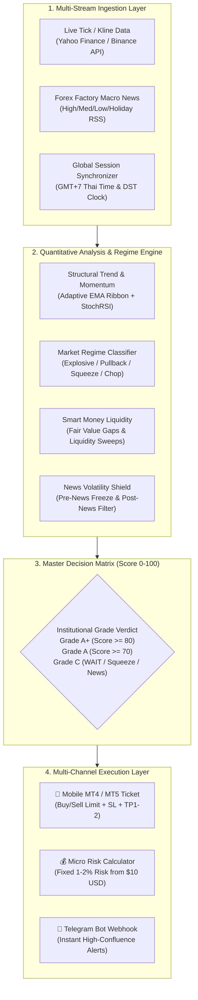

<div align="center">

# 🏛️ AEGIS QUANT TERMINAL
### Institutional Multi-Asset Confluence Engine & Mobile MT4/MT5 Execution Terminal

[](https://nextjs.org/)
[](https://www.typescriptlang.org/)
[](https://tailwindcss.com/)
[](https://www.tradingview.com/)
[](https://ai.google.dev/)
[](https://www.metatrader5.com/)
[](https://vercel.com/)

<p align="center">
  <b>ระบบเทอร์มินัลวิเคราะห์การเงินระดับสถาบัน (Quantitative Trading Terminal) ที่ผสานตรรกะ Smart Money Concepts (SMC), การจำแนกสภาวะตลาดแบบพลวัต (Market Regime Clustering), ปฏิทินข่าวสารเศรษฐกิจมหภาค Forex Factory 4 สี และเครื่องคิดเลขบริหารความเสี่ยงระดับไมโคร (เริ่ม $10 USD) ออกเป็นตั๋วคำสั่งซื้อขายล่วงหน้า (Pending Order Ticket) สำหรับส่งคำสั่งบน MT4 / MT5 ได้อย่างแม่นยำ</b>
</p>

[✨ Live Demo](#-quick-start) • [🧠 ปรัชญาระบบ](#-quantitative-trading-architecture) • [📊 5 เสาหลัก Confluence](#-5-pillar-institutional-confluence-matrix) • [🛡️ เกราะป้องกันข่าว 4 สี](#-forex-factory-4-color-economic-shield) • [📱 ตั๋วเทรด MT4/MT5](#-mobile-mt4--mt5-pending-order-ticket)

</div>

---

## 🧠 Quantitative Trading Architecture

สถาปัตยกรรมของ Aegis Quant ถูกออกแบบมาเพื่อแก้ปัญหา **"ความตาบอดมิติเดียวของอินดิเคเตอร์ทั่วไป (One-Dimensional Lagging Blindness)"** โดยผสานชั้นข้อมูลการเงิน 5 มิติเข้าด้วยกันในระดับ Pipeline เดียว:



---

## 🏛️ 5-Pillar Institutional Confluence Matrix

ระบบจะไม่ยอมออกสัญญาณเพียงเพราะ "RSI Oversold" หรือ "เส้นตัดกัน" แต่ต้องผ่านการตรวจสอบแบบถ่วงน้ำหนักจาก **5 เสาหลักสถาบันการเงิน**:

| เสาหลัก (Pillar) | น้ำหนัก | เกณฑ์การพิจารณาทางเทคนิคอลและควอนต์ |
| :--- | :---: | :--- |
| **1. Trend & Regime Stability** | **25%** | คัดกรองทิศทางคลื่นใหญ่ (HTF EMA 200/50) ร่วมกับ **ADX Chop Filter (ADX >= 21)** ตัดการเทรดในตลาดไซด์เวย์ไร้วอลุ่มออก 100% |
| **2. Multi-Cycle Momentum** | **20%** | วัดรอบแกว่งตัวของราคาด้วย StochRSI และตรวจจับสัญญาณ Bullish/Bearish Divergence ก่อนที่ราคาจะกลับตัวจริง |
| **3. Smart Money Structure & FVG** | **20%** | คำนวณหาจุดไม่สมดุลของสภาพคล่อง (**Fair Value Gap - FVG**) และตรวจจับพฤติกรรมกวาดสภาพคล่องรายย่อย (**Liquidity Sweep Rejection**) |
| **4. Global Session Liquidity** | **15%** | ถ่วงน้ำหนักความน่าเชื่อถือตามช่วงเวลาตลาดโลก (GMT+7) เน้นเข้าเทรดเฉพาะช่วง **Golden Hours (London & NY Overlap)** |
| **5. Macro Economic Calendar** | **20%** | ตรวจสอบผลกระทบข่าวตัวเลขเศรษฐกิจสหรัฐฯ และธนาคารกลาง เพื่อสั่งระงับสัญญาณทันทีก่อนและหลังข่าวรุนแรง |

---

## 🛡️ Forex Factory 4-Color Economic News Shield

การเทรดทองคำและคู่เงินโดยไม่ดูปฏิทินข่าวคือสาเหตุอันดับ 1 ของการพอร์ตแตก ระบบได้โปรแกรมกฎกลยุทธ์รับมือ 4 กล่องข่าวเศรษฐกิจเข้าไปในสมองกลอัตโนมัติ:

```
🟥 1. กล่องแดง (High Impact) — รุนแรงสูงสุด (NFP, CPI, Fed Interest Rates)
     └─ Action: ห้ามสวนเทรนด์เด็ดขาด! ระบบสั่ง Freeze ล็อกสถานะเป็น WAIT ทันที (30 นาทีก่อนข่าว และ 15 นาทีหลังข่าว)

🟧 2. กล่องส้ม (Medium Impact) — ผันผวนปานกลาง (PMI, Retail Sales)
     └─ Action: กราฟวิ่งตามทิศทางตัวเลข ไม่กระชากทำลายล้าง สามารถ Follow Trend ตามระบบได้ แต่ต้องมี SL เสมอ

🟨 3. กล่องเหลือง (Low Impact) — ผันผวนต่ำ (Trade Balance, Secondary Stats)
     └─ Action: สวรรค์สายเทคนิคอล กราฟเคารพแนวรับ-แนวต้านแม่นยำสูงสุด ระบบอนุมัติสัญญาณเต็มประสิทธิภาพ

⬜️ 4. กล่องเทา/ขาว (Bank Holiday) — วันหยุดธนาคารสหรัฐฯ/ยุโรป
     └─ Action: วอลุ่มแห้งสนิท กราฟวิ่งแคบและสเปรดถ่างกว้าง ระบบแนะนำให้พักการเทรดหรือถือเงินสด
```

---

## 📱 Mobile MT4 / MT5 Pending Order Ticket

ออกแบบโครงสร้างตั๋วเทรดล่วงหน้า (Pending Order) ให้ตรงกับหน้าต่างคำสั่งในแอป **MetaTrader 4 / 5 บนโทรศัพท์มือถือ 100%**:

```text
══════════════════════════════════════════════════════════════════════════
📋 MT4 / MT5 MOBILE PENDING ORDER TICKET
══════════════════════════════════════════════════════════════════════════
• ประเภทคำสั่ง (Order Type)  : 🟢 BUY LIMIT (ตั้งรับของถูกล่วงหน้าที่แนวรับ FVG)
• 1. ราคาตั้งเปิด (Price)    : 4,453.32 [แตะเพื่อคัดลอก]
• 2. จุดตัดขาดทุน (SL)       : 4,433.59 (-362 pips • ป้องกันไส้กวาด +0.3 ATR)
• 3. จุดทำกำไร 1 (TP1)      : 4,506.01 (+362 pips • อัตรา 1.0R เลื่อน SL บังทุน)
• 4. จุดทำกำไร 2 (TP2)      : 4,534.98 (+652 pips • จุดปล่อยรันเทรนด์สถาบัน)
• อัตราความคุ้มค่า (R:R)     : 1 : 1.8
══════════════════════════════════════════════════════════════════════════
```

### 🧮 เครื่องคิดเลขบริหารหน้าตักระดับไมโคร (Dynamic Micro-Account Risk Engine)
รองรับพอร์ตขนาดเล็กเริ่มต้นตั้งแต่ **$10 USD** ขึ้นไป พร้อมระบบสลับโหมดบัญชี:
* **💵 Standard Account ($):** สำหรับพอร์ตทั่วไป คำนวณ Lot ขั้นต่ำ (0.01 Lot) พร้อมคำนวณการติดลบ/กำไรเป็นเงินดอลลาร์จริง
* **🪙 Cent Account (USC):** แปลง $10 USD เป็น 1,000 Cents ช่วยให้สายปั้นพอร์ตขนาดเล็กสามารถควบคุมความเสี่ยง **1% - 2% (เสียไม้ละไม่เกิน $0.10 - $0.20)** ได้อย่างแม่นยำระดับเซนต์ ป้องกันพอร์ตแตก 100%

---

## ⏰ นาฬิกาเซสชันตลาดโลก (เวลาไทย GMT+7) & Golden Hours

ระบบแปลงเวลา UTC สดเข้าสู่เวลาไทย พร้อมตรวจจับการเปลี่ยนฤดูกาล (Daylight Saving Time - DST) โดยอัตโนมัติ:

| เซสชันตลาด | เวลาไทย (ฤดูร้อน DST) | เวลาไทย (ฤดูหนาว Standard) | พฤติกรรมและกลยุทธ์ของระบบ |
| :--- | :---: | :---: | :--- |
| **Sydney (ออสเตรเลีย)** | 04:00 – 12:00 น. | 05:00 – 13:00 น. | วอลุ่มต่ำ กราฟไซด์เวย์แคบ เน้นรอสัญญาณ |
| **Tokyo (เอเชีย/ญี่ปุ่น)** | 06:00 – 14:00 น. | 06:00 – 14:00 น. | วอลุ่มเริ่มเข้าในคู่เงิน JPY กราฟทองคำมักสะสมพลังในกรอบ |
| **London (ยุโรป/อังกฤษ)** | 13:00 – 21:00 น. | 14:00 – 22:00 น. | 🔥 **Golden Hours 1 (14:00 - 16:00 น.)** สถาบันเริ่มเทรด วอลุ่มระเบิด |
| **New York (สหรัฐอเมริกา)** | 18:00 – 02:00 น. | 19:00 – 03:00 น. | 🔥 **Golden Hours 2 (19:00 - 22:00 น.)** ตลาดลอนดอนซ้อนทับกับนิวยอร์ก ทองคำวิ่ง 1,000–3,000 จุด |
| ⚠️ **The Witching Hour** | **03:55 – 05:05 น.** | **03:55 – 05:05 น.** | ⛔ **สั่งห้ามเทรดเด็ดขาด!** ช่วงเคลียร์บัญชีธนาคาร สเปรดถ่างกว้าง 10-20 เท่า |
| ⚠️ **Monday Open Gap** | **04:00 – 06:00 น.** | **04:00 – 06:00 น.** | ⛔ **ระวัง Gap ตลาดเปิดเช้าวันจันทร์** สั่งระงับคำสั่งจนกว่ากราฟจะปิด Gap |

---

## 🗂️ Clean Modular File Architecture

โครงสร้างไฟล์ถูกออกแบบตามหลัก Clean Architecture ระดับความลึกไม่เกิน 2 ชั้น เพื่อให้อ่านง่ายและขยายระบบได้รวดเร็ว:

```text
indicator/
├── 📂 app/                              # Next.js 14 App Router
│   ├── 📂 api/                          # Flat Microservices API Layer
│   │   ├── 📄 analyze/route.ts          # AI Confluence & Multi-Pillar Engine
│   │   ├── 📄 backtest/route.ts         # Historical Simulation Engine
│   │   ├── 📄 cron/route.ts             # Hourly Auto-Scanner
│   │   ├── 📄 market-data/route.ts      # Multi-Asset Realtime Candles
│   │   ├── 📄 news/route.ts             # Economic Calendar 4-Color Feed
│   │   └── 📄 telegram/route.ts         # Telegram Webhook Dispatcher
│   ├── 📄 globals.css                   # Tailwind Design System
│   ├── 📄 layout.tsx                    # Master Shell
│   └── 📄 page.tsx                      # Unified Trading Terminal View
│
├── 📂 components/                       # Flat React Component Suite
│   ├── 📄 AnalysisCard.tsx              # MT4/MT5 Ticket & $10 Micro-Risk Calculator
│   ├── 📄 AssetSelector.tsx             # Multi-Market Asset Hub (Gold, FX, Crypto)
│   ├── 📄 Header.tsx                    # Realtime Clock & Session Radar
│   ├── 📄 MarketChart.tsx               # TradingView Lightweight Charts Visualizer
│   ├── 📄 NewsFeed.tsx                  # 4-Box Calendar & Live News Stream
│   └── 📄 TelegramSettingsModal.tsx     # Bot Configuration Portal
│
├── 📂 lib/                              # Pure Quantitative Calculation Engines
│   ├── 📄 types.ts                      # Strict TypeScript Interfaces
│   ├── 📄 indicators.ts                 # Vectorized Indicator Math (EMA, RSI, ATR, etc.)
│   ├── 📄 marketService.ts              # Resilient Multi-Source Market Connector
│   ├── 📄 newsService.ts                # Financial Sentiment & Calendar Parsers
│   ├── 📄 geminiService.ts              # Gemini AI LLM Synthesizer & Rule Interlock
│   ├── 📄 confluenceEngine.ts           # 5-Pillar Confluence Scoring Algorithm
│   ├── 📄 regimeClassifier.ts           # 4-Regime Dynamic Parameter Switching
│   ├── 📄 sessionEngine.ts              # GMT+7 Daylight Saving & Session Tracker
│   ├── 📄 calendarEngine.ts             # High-Impact Red Folder Shield Logic
│   ├── 📄 backtestEngine.ts             # 6-Rule Historical Simulation Sandbox
│   ├── 📄 optimizerEngine.ts            # Dynamic Parameter Optimization Grid
│   └── 📄 telegramService.ts            # MarkdownV2 Mobile Alert Builder
│
└── 📂 mql/                              # MetaTrader Execution Scripts
    ├── 📄 AI_Trend_Signal.mq4           # Native MT4 Indicator Script
    ├── 📄 AI_Trend_Signal.mq5           # Native MT5 Indicator Script
    └── 📄 HOW_TO_INSTALL.md             # Deployment Manual for MetaTrader
```

---

## ⚡ Quick Start

### 1. โคลนและติดตั้งโปรเจกต์
```bash
git clone https://github.com/chxlor1-8atb/indicator.git
cd indicator
npm install
```

### 2. กำหนดค่าสภาพแวดล้อม (.env.local)
สร้างไฟล์ `.env.local` จาก `.env.example`:
```env
# Google Gemini API Key (รับฟรีได้ที่ https://aistudio.google.com/)
GEMINI_API_KEY=your_gemini_api_key_here

# Real-time Market Data API Key
MASSIVE_API_KEY=your_massive_api_key_here

# Vercel Cron Security Secret
CRON_SECRET=your_custom_cron_secret_here

# (ตัวเลือกเสริม) Telegram Bot สำหรับส่งสัญญาณเข้ามือถือ
# TELEGRAM_BOT_TOKEN=your_bot_token_here
# TELEGRAM_CHAT_ID=your_chat_id_here
```

### 3. รันโปรเจกต์
```bash
npm run dev
```
เปิดเบราว์เซอร์ไปที่: `http://localhost:3000`

---

## 🚢 One-Click Vercel Deployment

โปรเจกต์นี้ถูกปรับแต่งให้รันบน Serverless Architecture ของ **Vercel** อย่างสมบูรณ์แบบ:
1. เข้าไปที่ [Vercel Dashboard](https://vercel.com/dashboard)
2. กด **Add New Project** และเลือก Repository `chxlor1-8atb/indicator`
3. กำหนดค่า Environment Variables:
   * `GEMINI_API_KEY`
   * `MASSIVE_API_KEY`
   * `CRON_SECRET`
4. กด **Deploy** พร้อมใช้งาน 24/7 ทันที!

---

## 📜 Disclaimer & Risk Disclosure
*การเทรดสินทรัพย์ที่มีเลเวอเรจสูง เช่น ทองคำ (XAU/USD), Forex และ Cryptocurrency มีความเสี่ยงสูงต่อเงินทุน ระบบนี้ถูกสร้างขึ้นเพื่อเป็นเครื่องมือช่วยวิเคราะห์เชิงปริมาณ (Quantitative Decision-Support System) และบริหารความเสี่ยง ผู้ใช้งานควรใช้วิจารณญาณและบริหารขนาดไม้ (Position Sizing) อย่างเคร่งครัดเสมอ*

---

<div align="center">
  <sub>Crafted with engineering precision and quantitative discipline by <a href="https://github.com/chxlor1-8atb">chxlor1-8atb</a>.</sub>
</div>